# 💠 ERP-System

Spring 기반의 **기업 자원 관리 시스템(ERP)** 입니다.
실무 환경을 반영한 **기업형 자재·계약 중심 ERP 시스템**으로, 품목·계약·재고 흐름을 통합적으로 관리할 수 있도록 구현하였습니다.

---

## 기획 배경

ERP 도입을 희망하는 중소기업 환경을 가정하여, 
자재·공급업체 관리, 계약 기반 발주 및 재고 흐름을 한눈에 관리할 수 있는 시스템을 구현하였습니다. 

---

## 프로젝트 개요


|         항목             |                         내용                                 |
|-------------------------|-------------------------------------------------------------|
|        프로젝트 명         |   ERP-System                                                |
|        개발 기간          |    2025.04 ~ 2025.05                                         |
|        개발 형태          |    팀 프로젝트                                                  |
|        담당 역할          |    DB 설계, 로그인 기능, 품목·공급업체·계약·재고관리 구현                |
|        주요 기능          |    로그인, 품목 등록, 계약 관리, 발주 및 입출고 흐름                    |
|        GitHub           |    [ERP-System](https://github.com/hyeseo-kim/ERP-System)    |

---

## 기술 스택

|         분류             |                       사용 기술                               |
|-------------------------|-------------------------------------------------------------|
|       Language          |    Java 11                                                  |
|       Framework         |    Spring Boot 2.x, Spring MVC, MyBatis                     |
|         View            |    JSP, JSTL, Bootstrap 5                                   |
|          DB             |    MySQL 8.x                                                |
|       Build Tool        |    Gradle                                                   |
|          기타            |    Tomcat, Lombok                                           |

---

## 💡 주요 기능 및 화면 미리보기

### 1. 로그인 / 메인 대시보드

- 사원 로그인 및 메인 홈 대시보드 진입
- 월별 통계차트, 알림 UI 등 표시

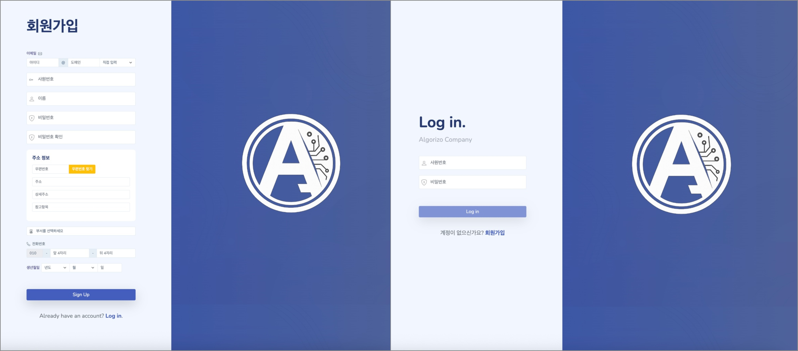
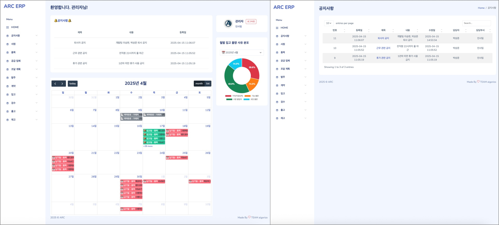

---

### 2. 품목 관리

- 품목 등록 시 초기 재고는 0으로 설정
- 등록된 품목 목록 및 상세 정보 확인 가능

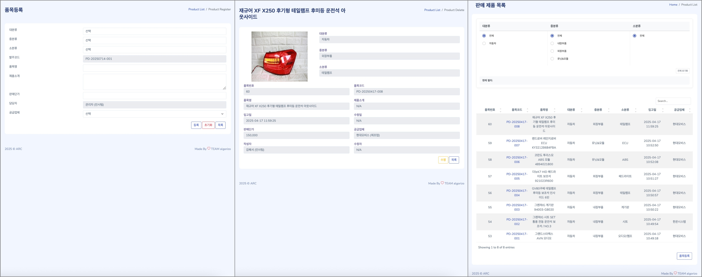

---

### 3. 공급업체 관리

- 공급업체 등록, 목록 조회, 상세 확인

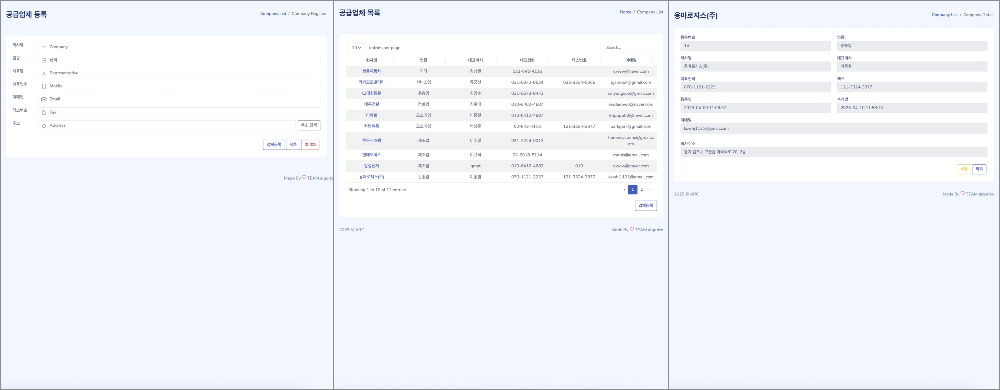

---

### 4. 계약 관리

- 공급업체와 품목 계약 등록
- 계약 상세 및 계약 금액 확인 가능

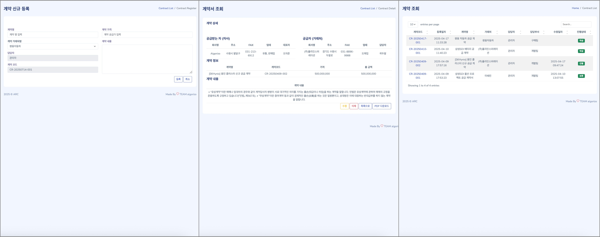

---

### 5. 조달계획 & 발주

- 계획 수립 후 발주 등록 가능
- 발주 시 해당 품목 및 계약 기반으로 자동 세팅


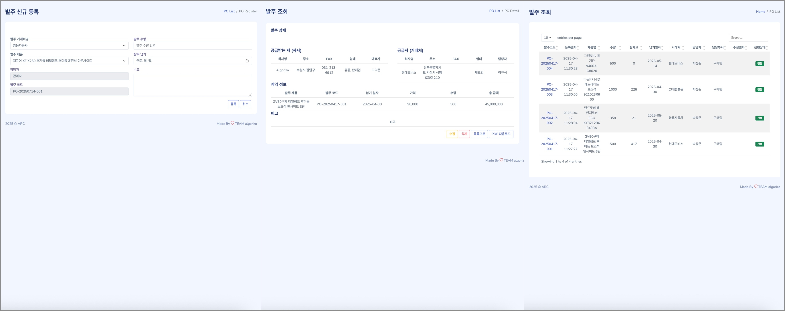

---

### 6. 입고 -> 검수 -> 출고 (자재 흐름 관리)

- 입고 등록 후 검수 -> 수량만큼 재고 증가
- 검수 완료 후 출고 가능 -> 재고 감소

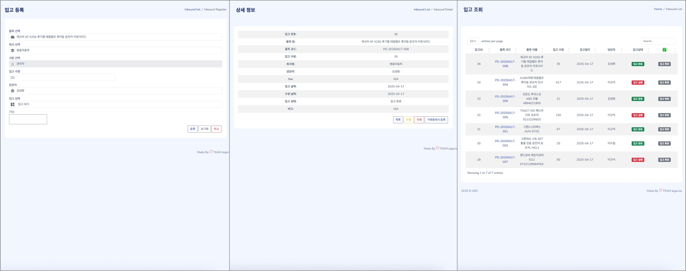
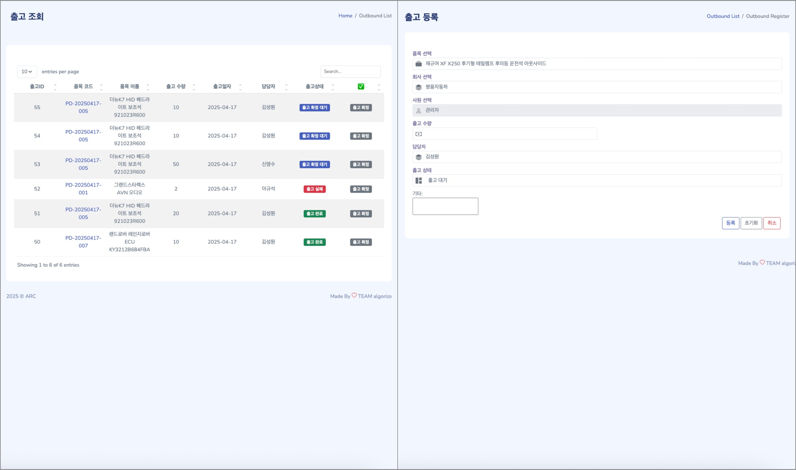

---

### 7. 재고 관리

- 품목별 현재 재고 확인
- 입고/출고 이력 기반 실시간 재고 갱신

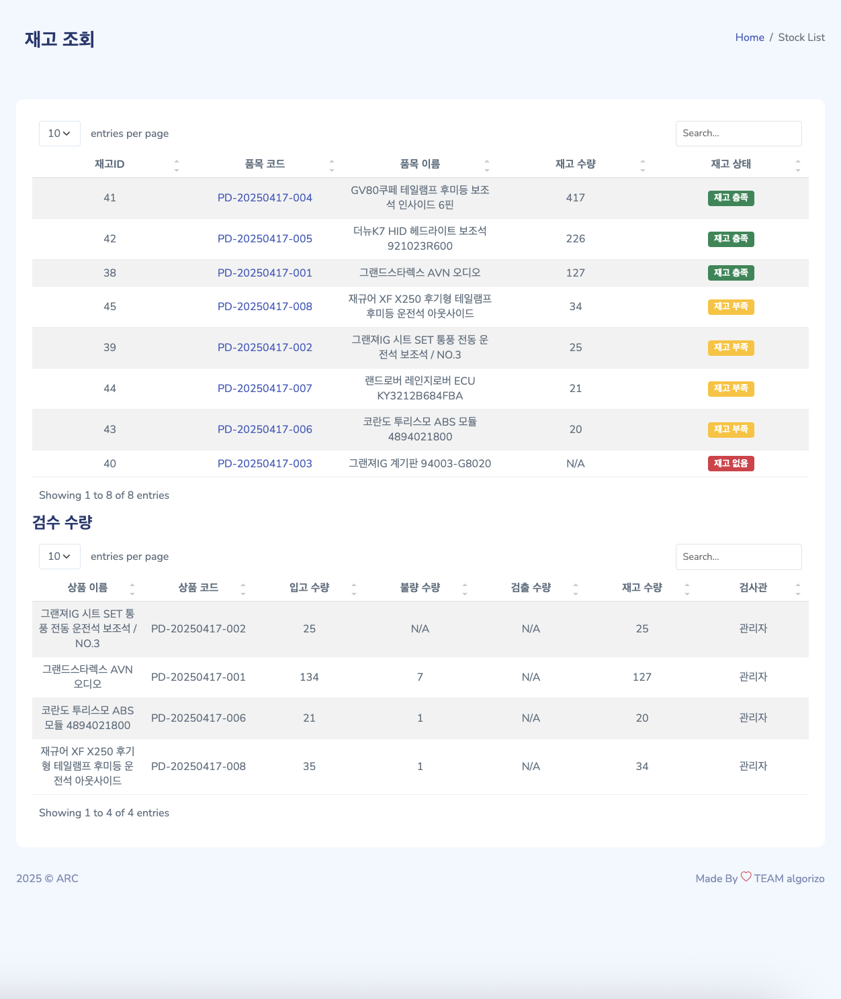

---

### 8. 사원 관리

- 사원 등록 (이름, 부서, 직책, 연락처 등)
- 전체 사원 목록 조회 및 상세정보 확인
- 부서 별 필터링 기능 포함

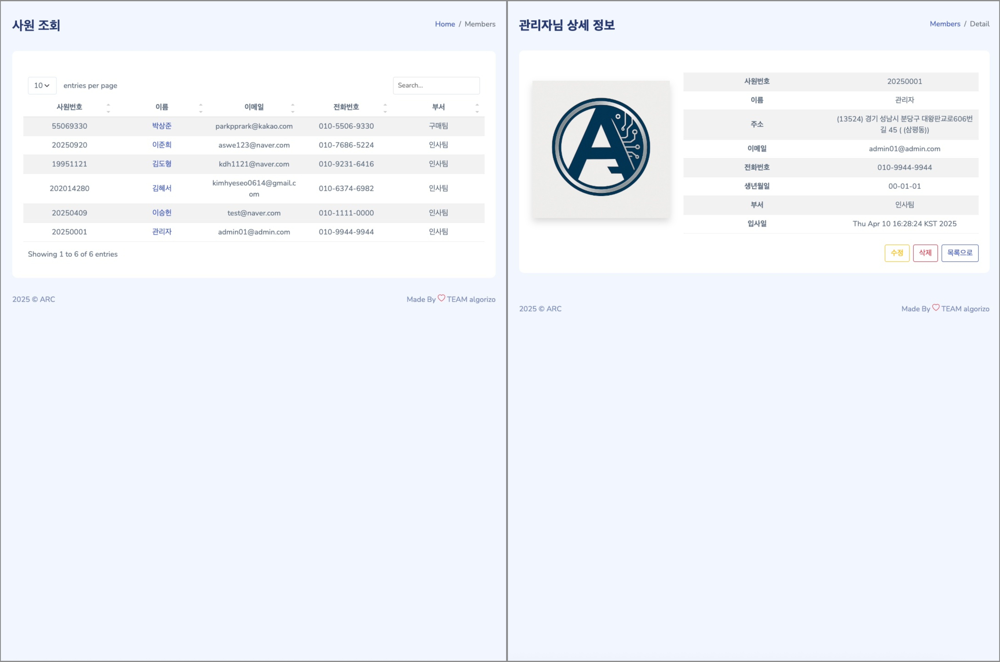

---

## 전체 흐름도

```text
[로그인]
   ↓
[대시보드 진입]
   ↓
[품목 등록] ← [사원 / 공급업체 등록]
   ↓
[계약 등록]
   ↓
[조달계획 수립 → 발주]
   ↓
[입고 등록 → 검수 완료 여부 확인]
   ↓
[입고 처리 → 출고 처리]
```

<p align="center">
  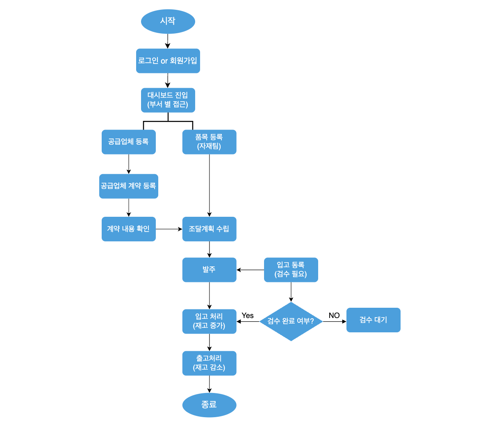
</p>

---

## 프로젝트 구조
<details>
<summary>📁 프로젝트 구조 보기</summary>

````text
erp-system/
┣ src/
┃ ┣ main/
┃ ┃ ┣ java/
┃ ┃ ┃ ┗ co.algorizo.erp/
┃ ┃ ┃ ┃ ┣ board/
┃ ┃ ┃ ┃ ┣ calendar/
┃ ┃ ┃ ┃ ┣ company/
┃ ┃ ┃ ┃ ┣ config/
┃ ┃ ┃ ┃ ┣ contract/
┃ ┃ ┃ ┃ ┣ dept/
┃ ┃ ┃ ┃ ┣ inbound/
┃ ┃ ┃ ┃ ┣ inbound_receipt/
┃ ┃ ┃ ┃ ┣ inspection/
┃ ┃ ┃ ┃ ┣ interceptor/
┃ ┃ ┃ ┃ ┣ order/
┃ ┃ ┃ ┃ ┣ outbound/
┃ ┃ ┃ ┃ ┣ outbound_receipt/
┃ ┃ ┃ ┃ ┣ outinspection/
┃ ┃ ┃ ┃ ┣ procurement_plan/
┃ ┃ ┃ ┃ ┣ product/
┃ ┃ ┃ ┃ ┣ register/
┃ ┃ ┃ ┃ ┣ stock/
┃ ┃ ┃ ┃ ┣ HomeController.java
┃ ┃ ┃ ┃ ┗ ImageServlet.java
┃ ┃ ┣ resources/
┃ ┃ ┃ ┣ application.properties
┃ ┃ ┃ ┣ mappers/
┃ ┃ ┃ ┣ log4j.xml
┃ ┃ ┃ ┗ mybatis-config.xml
┃ ┃ ┗ webapp/
┣ build.gradle
┗ ...
````
</details>


## 실행 방법

### 1. `application.properties` 환경 설정
```properties
spring.datasource.url=jdbc:mysql://localhost/algorizo?severTimezone=UTC
spring.datasource.username=root
spring.datasource.password=12345678
spring.jpa.hibernate.ddl-auto=update
google.api.key=YOUR_GOOGLE_API_KEY
openweather.api.key=YOUR_OPENWEATHER_API_KEY
```

### 2. 실행 방법
```bash
./gradlew bootRun
```

### 3. 브라우저에서 접속
▶ http://localhost:8080

---

## 개발자 정보

- 김혜서
- GitHub : [@hyeseo-kim](https://github.com/hyeseo-kim)
- Email : hyeseo0614@gmail.com

---

## 트러블 슈팅 및 개선사항

### 문제상황
- 팀프로젝트 중 `ProductController.java` 파일에서 **대규모 git충돌 발생**
- 각 팀원이 기능 개발을 독립적으로 진행했으나, 기능 통합시 Git충돌로 인해 전체 빌드가 실패하고 코드 손실 우려

### 원인 분석
- 동일 파일 및 동일 메서드에 대한 병렬 수정 작업
- Git 자동병합 실패 → HEAD 충돌 상태 발생
- Session, Model 객체 중복 사용으로 병합 난이도 증가

### 해결 과정
- InteliJ `Conflict Resolve` 기능 활용 → 변경사항 시각 비교 및 수동 병합
- 공통 로직은 별도 메서드로 분리 → 중복 제거
- 전 기능 정상 동작 여부 수동 테스트 및 빌드 완료

### 개선 결과
- 브랜치 전략 수정 후 충돌 발생률 80% 감소
- 빌드 안정성 및 팀 협업 효율 대폭 향상

---

### 데모 영상
